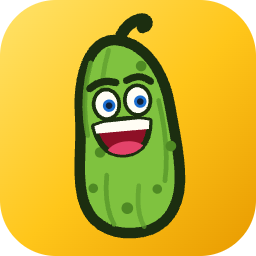

<div align="center">



# guerkchen

**Ein kleiner Gherkin-Editor für macOS, der dafür sorgt, dass du Anforderungen immer im gleichen Format und mit dem gleichen Vokabular beschreibst.**

[](https://github.com/fuerstenberg/guerkchen/actions/workflows/build.yml)
[](LICENSE)
[](#installation)

</div>

## Wofür ist guerkchen gedacht?

guerkchen ist als Werkzeug entstanden, um **Anforderungen an eine KI** aufzuschreiben — und zwar
jedes Mal in derselben festen Struktur:

```gherkin
# language: de
Funktionalität: Anmeldung
  Als registrierter Nutzer
  möchte ich mich anmelden können,
  damit ich mein persönliches Dashboard sehe

  Szenario: Erfolgreiche Anmeldung
    Gegeben sei der Nutzer ist auf der Anmeldeseite
    Wenn der Nutzer gültige Zugangsdaten eingibt
    Dann sieht der Nutzer das Dashboard
```

Gherkin (`.feature`) ist dafür ein guter Rahmen: Rolle, Ziel und Nutzen stehen oben, die
Erwartungen darunter als Given/When/Then. Kein Prosa-Wust, keine Interpretationslücken — und
weil das Format schon lange existiert, verstehen es Sprachmodelle ebenso gut wie Menschen.

Das eigentliche Problem beim Aufschreiben ist nicht die Struktur, sondern die **Sprachdisziplin**:
In Datei A steht „der Nutzer ist angemeldet“, in Datei B „ein eingeloggter User“ — gemeint ist
dasselbe. Genau da setzt guerkchen an. Beim Tippen schlägt der Editor zwei Dinge vor:

1. die **Schlüsselwörter** des gewählten Gherkin-Dialekts (`g` → `Given`, `sc` → `Scenario`,
   `Scenario O` → `Scenario Outline`), und
2. alle **Step-Texte, die im Projekt schon existieren** (`Given ` + `a u` → `a user is logged in`).

So entsteht über alle Dateien hinweg ein einheitliches Vokabular, ohne dass man ein Glossar
pflegen muss. Ein Ordner ist ein Projekt, die `.feature`-Dateien darin sind der Wortschatz.

guerkchen ist bewusst **kein** Test-Runner, kein Cucumber-Ersatz und kein Step-Definition-Generator.
Es ist ein Editor — mehr nicht. Die Feature-Dateien landen anschließend dort, wo du sie brauchst:
im Prompt, im Repository oder in einem echten Cucumber-Setup.

> **Note** — Die App-Oberfläche ist auf Deutsch. Bearbeitet werden können Feature-Dateien in allen
> Gherkin-Dialekten (rund 80 Sprachen, via `# language:`-Zeile).

## Features

- **Projekt = Ordner.** Dateibaum mit Ordnern und `.feature`-Dateien; anlegen, umbenennen und in
  den Papierkorb legen per Kontextmenü. Änderungen von außen werden automatisch übernommen.
- **Suggest beim Tippen.** Ab dem ersten Zeichen, Fuzzy-Matching, max. 10 Einträge.
  Pfeiltasten wählen, Enter/Tab übernimmt, Escape schließt.
- **Alle Gherkin-Dialekte.** Erkennung über die offizielle `# language: de`-Zeile, Fallback `en`.
  Step-Vorschläge kommen nur aus Dateien derselben Sprache.
- **Syntax-Highlighting** für acht Kategorien: Feature/Rule, Background, Scenario/Outline/Examples,
  Steps, Kommentare, Tags, Tabellen, Doc-Strings — jede Farbe in den Einstellungen anpassbar,
  mit Reset auf die Standardwerte.
- **Autosave.** Rund eine Sekunde nach der letzten Änderung, beim Dateiwechsel und beim Beenden.
- **Zuletzt geöffnet.** Das letzte Projekt öffnet beim Start wieder, die zehn letzten stehen im Menü.
- **Sandboxed**, ohne Netzwerkzugriff und ohne Fremdabhängigkeiten.

## Installation

Fertige Builds liegen unter [Releases](https://github.com/fuerstenberg/guerkchen/releases) —
`latest` ist der jeweils aktuelle Stand von `main`. Universal Build (Apple Silicon + Intel),
benötigt **macOS 15 oder neuer**.

1. ZIP herunterladen, entpacken, `guerkchen.app` nach `/Applications` ziehen.
2. Die App ist nur ad-hoc signiert und nicht notarisiert, deshalb blockiert macOS den ersten Start.
   Einmalig das Quarantäne-Flag entfernen:

   ```sh
   xattr -dr com.apple.quarantine /Applications/guerkchen.app
   ```

Zum Ausprobieren: App starten, „Ordner öffnen…“ und den mitgelieferten Ordner
[`Examples/demo-project`](Examples/demo-project) wählen.

## Selbst bauen

Vorausgesetzt werden Xcode 26 und [XcodeGen](https://github.com/yonaskolb/XcodeGen)
(`brew install xcodegen`).

```sh
git clone https://github.com/fuerstenberg/guerkchen.git
cd guerkchen
swift test --package-path Core          # Tests der UI-freien Schichten
xcodegen generate                       # erzeugt guerkchen.xcodeproj
xcodebuild -scheme guerkchen -configuration Debug build
```

`guerkchen.xcodeproj` ist nicht eingecheckt und wird immer aus [`project.yml`](project.yml) erzeugt.

## Aufbau

Die UI-freien Schichten liegen in einem lokalen Swift-Package, damit ihre Tests ohne Xcode-Testhost
laufen:

| Pfad | Inhalt |
| --- | --- |
| `Core/Sources/GuerkchenCore/Gherkin/` | Dialekte aus `gherkin-languages.json`, zeilenweiser Scanner |
| `Core/Sources/GuerkchenCore/Project/` | Ordner als Projekt, Dateibaum, FSEvents-Watcher, Step-Index |
| `Core/Sources/GuerkchenCore/Suggest/` | Vorschlagslogik und Fuzzy-Matcher |
| `App/` | SwiftUI-Shell mit `NSTextView` via `NSViewRepresentable` |
| `Design/AppIcon/` | Icon-Quellen und gerenderte Größen ([Details](Design/AppIcon/README.md)) |
| `docs/superpowers/` | Design-Spezifikation und Umsetzungsplan |

## Status

Ein Hobbyprojekt, das genau das tut, was ich davon brauche. Es gibt keine Roadmap, keine
Support-Zusage und keine garantierten Antwortzeiten. Issues und Pull Requests sind willkommen,
können aber unbeantwortet bleiben — wer mehr oder anderes will, darf die MIT-Lizenz gerne
ausnutzen und forken.

## Lizenz

[MIT](LICENSE) — © 2026 René Fürstenberg. Benutzen, ändern, weitergeben und verkaufen ist erlaubt,
solange der Copyright-Hinweis erhalten bleibt. Ohne Gewährleistung und ohne Haftung.

Enthaltene Drittanbieter-Bestandteile sind in
[THIRD-PARTY-NOTICES.md](THIRD-PARTY-NOTICES.md) aufgeführt: die Datei `gherkin-languages.json`
stammt aus dem [Cucumber-Projekt](https://github.com/cucumber/gherkin) und steht ebenfalls unter MIT.
